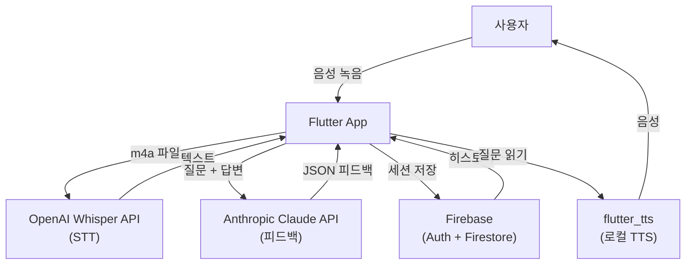
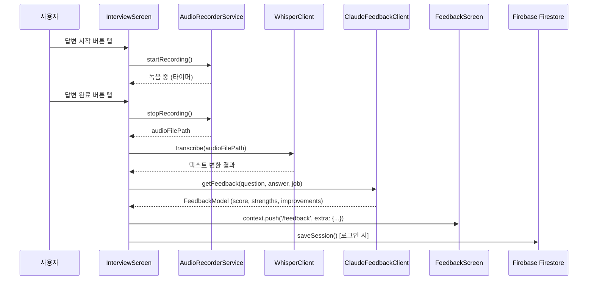

# 아키텍처 문서

## 시스템 구성도



## 레이어 구조

```
lib/
├── main.dart                    # 앱 진입점, ProviderScope
├── app.dart                     # GoRouter, MaterialApp.router
│
├── core/                        # 앱 전역 인프라
│   ├── api/
│   │   ├── whisper_client.dart  # OpenAI Whisper HTTP 클라이언트
│   │   └── claude_feedback_client.dart  # Anthropic Claude 클라이언트
│   ├── constants/
│   │   └── env.dart             # dart-define 환경 변수
│   ├── errors/
│   │   └── app_exception.dart  # sealed 예외 계층
│   └── services/
│       ├── audio_recorder_service.dart  # flutter_sound 래핑
│       └── tts_service.dart             # flutter_tts 래핑
│
├── features/                    # 기능별 모듈
│   ├── auth/
│   │   ├── repositories/auth_repository.dart
│   │   └── screens/login_screen.dart
│   ├── interview/
│   │   ├── models/session_model.dart
│   │   ├── repositories/session_repository.dart
│   │   └── screens/
│   │       ├── onboarding_screen.dart
│   │       └── interview_screen.dart
│   ├── feedback/
│   │   ├── models/feedback_model.dart
│   │   └── screens/feedback_screen.dart
│   ├── history/
│   │   └── screens/
│   │       ├── history_screen.dart
│   │       └── session_detail_screen.dart
│   └── result/
│       └── screens/result_screen.dart
│
└── shared/                      # 공용 컴포넌트
    ├── constants/question_bank.dart
    └── theme/app_theme.dart
```

## 핵심 데이터 흐름



## 상태관리 패턴

이 프로젝트는 **Riverpod 2.x** 를 사용하나, 현재 InterviewScreen은 `StatefulWidget`으로 구현되어 있습니다.  
복잡도가 낮은 단일 화면에서는 `StatefulWidget`을 사용하고, 공유 상태(인증, 세션 목록)에는 Riverpod Provider를 사용하는 전략입니다.

```
StatefulWidget    → 한 화면 안에서만 사용하는 로컬 상태 (녹음 타이머, 현재 질문 인덱스)
Riverpod Provider → 여러 화면이 공유하는 상태 (로그인 유저, 세션 목록 스트림)
```

## 라우팅 테이블

| 경로 | 화면 | Extra 파라미터 |
|------|------|---------------|
| `/` | OnboardingScreen | — |
| `/login` | LoginScreen | — |
| `/interview` | InterviewScreen | `job`, `type`, `count` |
| `/feedback` | FeedbackScreen | `feedback`, `question`, `answer`, `isLast`, `onNext`, `onFinish` |
| `/result` | ResultScreen | `job`, `results` |
| `/history` | HistoryScreen | — |
| `/session-detail` | SessionDetailScreen | `userId`, `sessionId`, `job`, `score` |
